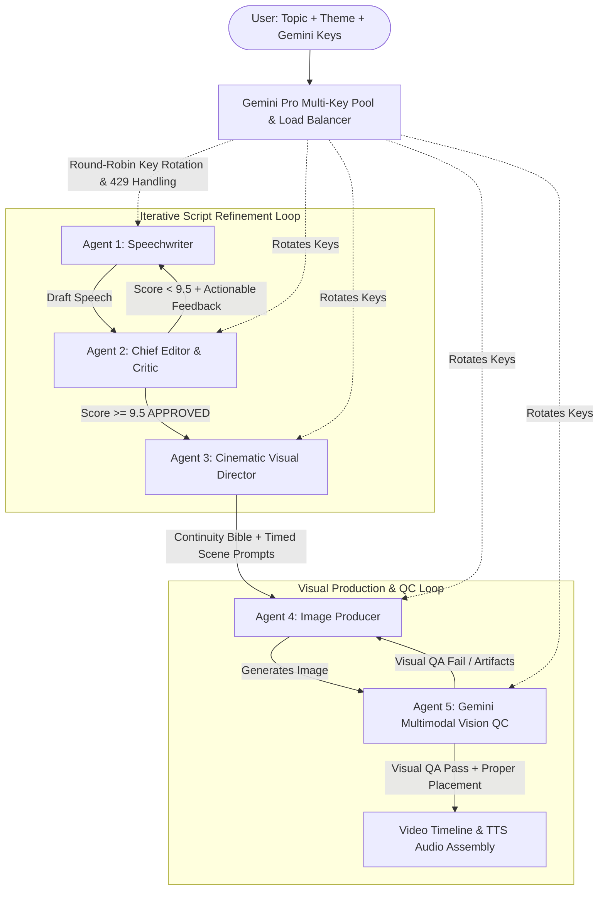
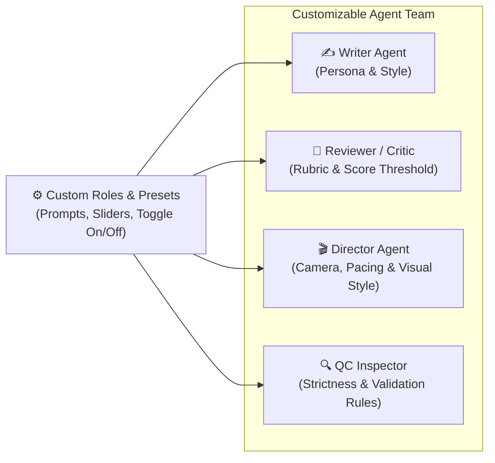
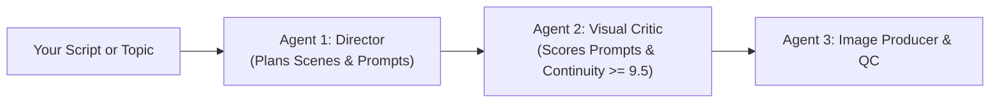
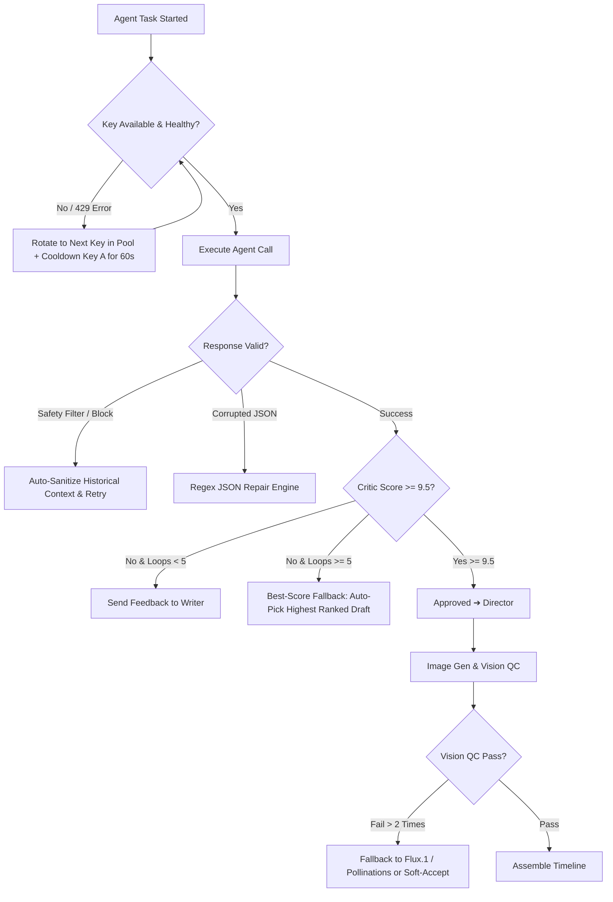
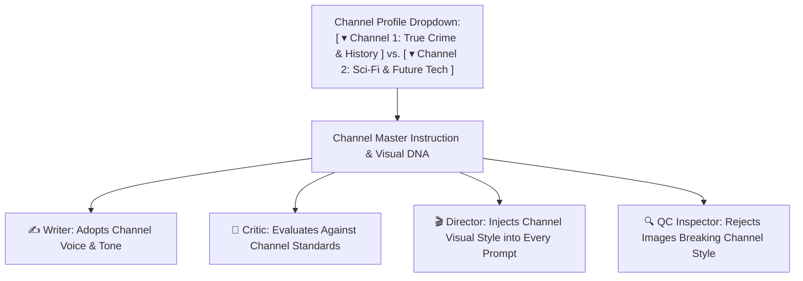
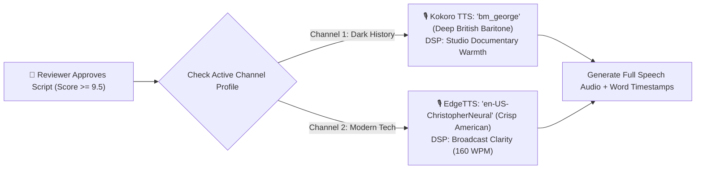

# Autonomous Multi-Agent Video Workflow — Retained Plan & Discussion

> **Status**: Recovered from local conversation session `dc458793-88a7-4f9a-9ae4-833ebaedf5ce` (Timestamp: 2026-09-28 18:51 - 19:33).

## Part 1: I have many gemini pro account. I can take api keys from there. i want to make these full process au

**User Prompt:**
```
I have many gemini pro account. I can take api keys from there. i want to make these full process automatic like agentic.. 

I will give the topic name someone write the speech according to my theme, some one review the speech, if need any changes then sends the corrections to the writer, so that he fix it.. 
Then review and rate it, untill it maches 9.5 up out of 10.. 

 someone will be director job is to plan the visualizations and make prompt.. 

And someone's job is to generate the image and check the images are placed in right area?
```

**Agreed Plan & Architecture:**

Here is how we can architect and implement your **Autonomous Multi-Agent Gemini Studio** right inside your Video Generation Tool.

---

### Multi-Agent Architecture Overview



---

### The 4 Agents & Their Exact Roles

| Agent | Name & Role | Core Task & Logic |
| :--- | :--- | :--- |
| **Agent 1** | **Speechwriter Agent** | Takes the topic, genre/theme (e.g. *Historical Documentary, True Crime, Tech Essay, Motivational*), and target duration. Writes a punchy, high-retention narration script. When receiving corrections from the Critic, it selectively revises the weak sections while preserving what worked. |
| **Agent 2** | **Chief Critic / Grader Agent** | Evaluates the draft on 5 metrics (0–10 scale): <br>1. *Hook & Opening Pacing*<br>2. *Emotional & Thematic Resonance*<br>3. *Story Arc & Narrative Flow*<br>4. *Spoken Cadence / Natural Prosody*<br>5. *Visual Suggestiveness*<br>Calculates total score: **If `< 9.5`**, returns line-by-line required corrections back to Agent 1. **If `>= 9.5`**, marks as
<truncated 1363 bytes>
es, matching [ApiKeyPoolManager.tsx](file:///e:/Projects/Video%20Generation%20Tool/src/components/Controls/ApiKeyPoolManager.tsx)).
2. **Round-Robin Rotation**: The Writer, Critic, Director, and Vision QC agents rotate across keys for every prompt/step.
3. **Automatic 429 Failover**: If any key hits a rate limit or quota freeze, the manager switches to the next healthy key in the pool, so the pipeline never stalls.

---

### Proposed Implementation Plan

1. **Backend Service (`electron/services/geminiAgenticStudioService.ts`)**:
   - Multi-key rotation engine with token/rate-limit tracking.
   - Script iterative generation loop (Writer ↔ Critic until score ≥ 9.5).
   - Director storyboard generator with Continuity Bible.
   - Image generation + Gemini Vision QC inspection (Prompt adherence & placement score).
2. **IPC Integration**:
   - Register `agentic-studio:start`, `agentic-studio:pause`, and real-time streaming event `agentic-studio:progress` in [electron/main.ts](file:///e:/Projects/Video%20Generation%20Tool/electron/main.ts) and [preload.ts](file:///e:/Projects/Video%20Generation%20Tool/electron/preload.ts).
3. **Studio UI Modal (`src/components/Controls/AgenticStudioModal.tsx`)**:
   - **Topic & Theme Inputs**: Topic, style preset, target duration, Gemini API key pool manager.
   - **Live Multi-Agent Chat Stream**: Visual log showing the Writer's draft, the Critic's line-by-line review & score gauge (e.g. `8.3/10 ➔ 9.1/10 ➔ 9.6/10 APPROVED`), Director breakdown, and Vision QC results.
   - **Visual Storyboard & Placement Grid**: Shows generated images, Vision QC pass status, and sync with script timecodes.
   - **1-Click "Assemble to Timeline"**: Creates all scenes, TTS audio (Kokoro/EdgeTTS), subtitles, and media onto your timeline editor.

---

### Confirmation

Would you like me to proceed with building this **Autonomous Multi-Agent Gemini Studio**? If you have specific preferences (such as preferred image model — Google Imagen 3 via Gemini API vs Flux, or target speech length), let me know!

---

## Part 2: can i controll and change their role?

**User Prompt:**
```
can i controll and change their role?
```

**Agreed Plan & Architecture:**

**Yes, absolutely!** You will have complete control over each agent's role, persona, instructions, and rules. 

You will not be locked into fixed prompts—you can customize, edit, toggle, or swap the roles to fit whatever type of content you are creating.

---

### What You Can Control & Change for Each Agent



| Agent | What You Can Customize & Change |
| :--- | :--- |
| **1. Writer Agent** | • **Persona & Tone**: Change from a *Serious BBC Historian* to a *Fast-Paced Viral YouTuber (MrBeast style)*, a *Dark True-Crime Narrator*, or a *Corporate Tech Presenter*.<br>• **Audience & Vocabulary**: Direct it to speak simply (grade 6), intellectually, or conversationally.<br>• **Structure Rules**: E.g., *"Must start with a 3-second provocative question, must include 3 cliffhangers"*. |
| **2. Reviewer / Critic** | • **Target Pass Score**: Change the threshold (e.g., set to `9.0`, `9.5`, or `9.8` for ultra-perfection).<br>• **Max Revision Loops**: Cap the iterations (e.g., `1` to `10` rounds) so it doesn't loop forever.<br>• **Scoring Rubric**: Tell it what matters most to you (e.g., prioritize *humor & pacing* over *factual depth*, or be *ruthlessly strict on repetitive words*). |
| **3. Director Agent** | • **Visual Theme & Aesthetic**: Set cinematic styles (e.g., *1970s Panavision 35mm film, Cyberpunk Neon, Minimalist Flat Vector, Hyper-realistic Unreal Engine 5*).<br>• **Shot Rhythm & Pacing**: Configure scene duration (e.g., fast cuts every 2.5s for TikTok vs. cinematic 6s cuts for YouTube).<br>• **Camera Language**: Force drone shots, extreme macro close-ups, or Dutch angles. |
| **4. Visual QC Inspector** | • **Verification Strictness**: Relaxed vs. Standard vs. Paranoid.<br>• **Inspection Criteria**: E.g., *"Reject any modern objects in ancient history scenes"*, *"Verify characters have correct clothing"*, *"Check 16:9 framing with no text watermarks"*.<br>• **Auto-Fix Action**: Regenerate with refined prompt or notify you for manual approval. |

---

### Additional Controls You Get

1. **Toggle or Skip Any Agent**:
   - If you already have your own speech written, you can **toggle off the Writer & Critic** and start directly from the Director.
   - If you want quick generation without visual review, you can **toggle off the QC Inspector**.
2. **Preset Profiles (Save & Load Teams)**:
   - Save your agent configurations into presets:
     - 📁 *“True Crime Documentary Team”*
     - 📁 *“Viral TikTok / Shorts Team”*
     - 📁 *“Sci-Fi Storytelling Crew”*
     - 📁 *“Business & Finance Explainer Crew”*
3. **Model & Temperature Tuning**:
   - Assign different Gemini models per agent (e.g., `gemini-1.5-pro` for deep storytelling script review, and ultra-fast `gemini-2.0-flash` for Director scene splitting and Vision QC inspection).
   - Adjust temperature (higher for creative writing, lower for structured JSON scene planning).

---

### How It Will Look in the UI

In the **Agentic Studio Modal**, each agent will have an **"Edit Role & Persona"** card:
- **System Prompt / Instructions Box** (with default templates you can edit or replace)
- **Role Name & Objective**
- **Sliders** (Passing Score: `9.5`, Scene Pacing: `4.0s`, Max Loops: `5`)
- **Live Test Button** (Preview how that specific agent responds before launching the full pipeline)

Would you like me to build this flexible role-customization system into the implementation?

---

## Part 3: can i change Writer Agent role to Director Agent?

**User Prompt:**
```
can i change Writer Agent role to Director Agent?
```

**Agreed Plan & Architecture:**

**Yes, 100%!** You can freely reassign, swap, or combine any agent's role. 

Here are the 3 main ways you can change the **Writer Agent into a Director Agent**:

---

### 1. Directing-Only Mode (When You Already Have a Script)
If you already have your own text, speech, or voiceover audio, you can change Agent 1’s role so its **very first task is Directing**:
* **Agent 1 (Director)**: Takes your topic or text ➔ immediately breaks it into cinematic visual scenes, timecodes, camera angles, and image prompts.
* **Agent 2 (Critic / Visual Reviewer)**: Instead of reviewing text, it reviews the **visual plan and prompts**, scoring them until they reach **9.5+** on visual coherence and cinematic detail.



---

### 2. "Writer-Director" (Hollywood Auteur Mode)
You can set Agent 1 to be a **Writer-Director** in a single pass:
* While it writes the speech, it simultaneously plans the visual shot for every line:
  > **Narrator Speech**: *"Deep within the Parisian catacombs, a secret door remained undisturbed for two centuries."*  
  > **Director Shot**: *[Extreme low-angle dolly shot, flickering torchlight, damp limestone walls, cinematic 35mm, dark moody shadows]*
* The **Critic** then rates both the speech quality AND the visual alignment together!

---

### 3. Modular Role Dropdown (Full Flexibility)
In the UI, every agent step can have a **Role Selector Dropdown**:

| Step | Role Options | Default |
| :--- | :--- | :--- |
| **Agent Slot 1** | `Speechwriter` \| `Visual Director` \| `Writer-Director (Auteur)` \| `Custom Role` | *Speechwriter* |
| **Agent Slot 2** | `Script Critic` \| `Visual Storyboard Critic` \| `Bypass / Skip` | *Script Critic* |
| **Agent Slot 3** | `Visual Director` \| `Style Prompt Specialist` \| `Bypass / Skip` | *Visual Director* |
| **Agent Slot 4** | `Image Generator + Vision QC` \| `Fast Gen Only (No QC)` | *Generator + QC* |

---

### What would you like to build first?
We can build the **Agentic Studio Service** with this modular role architecture so you can:
1. Paste your list of **Gemini Pro API keys**.
2. Pick or edit the roles for each agent (including setting Agent 1 as Director).
3. Set your target score threshold (e.g. `9.5`).
4. Click **"Run Autonomous Studio"** and watch the agents collaborate in real time!

Shall we begin setting up the backend service and UI?

---

## Part 4: what could be the fall back of the these system? and how can we manage the token exceed limit? in pr

**User Prompt:**
```
what could be the fall back of the these system? and how can we manage the token exceed limit? in pro account?
```

**Agreed Plan & Architecture:**

Here is a complete breakdown of the **potential fallbacks, risks, and failure points**, along with **how to manage token and rate limits across your Gemini Pro accounts**.

---

### Part 1: Failure Modes & Fallback Strategies



#### 1. Infinite Revision Loop (Never Reaching 9.5)
* **Risk**: The Critic might rate drafts `9.2`, `9.3`, `9.4` and keep demanding small edits, burning API tokens forever.
* **Fallback Solution**:
  * **Max Iteration Cap**: Enforce a strict ceiling (e.g., maximum 4–5 revision rounds).
  * **Best-Draft Selector**: If the 5th round finishes with a score of `9.4`, the system doesn't crash or fail—it automatically selects the highest-scoring draft across all rounds and proceeds to the Director.
  * **Plateau Detection**: If the score doesn't improve for 2 consecutive rounds, the system auto-approves the draft with a note to the user.

#### 2. Key Quota & Rate Limit Lockout (HTTP 429 / Resource Exhausted)
* **Risk**: Gemini Pro on free/standard tier has strict RPM (Requests Per Minute) and TPM (Tokens Per Minute).
* **Fallback Solution**:
  * **Dynamic Key Pool Failover**: If Key #1 returns `429 (Too Many Requests)`, it is immediately placed on a 60-second cooldown, and the request instantl
<truncated 2203 bytes>
Agent** ➔ **Gemini 1.5 Pro** *(where deep storytelling, literary flow, and critical grading logic are needed)*.
* **Director Scene Splitting & Prompts** ➔ **Gemini 2.0 Flash** *(where fast JSON generation and high speed are ideal)*.
* **Vision QC Inspector** ➔ **Gemini 2.0 Flash Vision** *(processing high-resolution images consumes lots of tokens; Flash handles this at near-zero quota cost)*.

#### 3. Macro Chunking (Paced Batches)
Instead of asking the Director to output 50 scenes in one massive 10,000-token prompt:
* The system uses **Macro Parts** (batches of 3–4 story beats at a time, exactly like [llmDirectorService.ts](file:///e:/Projects/Video%20Generation%20Tool/electron/services/llmDirectorService.ts#L363)).
* It inserts a configurable **1.5s–2.5s pacing rest** between batches, ensuring the sliding 60-second TPM window never hits the ceiling.

#### 4. Context Window Trimming (Slim Feedback Memory)
* When the Critic rejects a script and sends feedback to the Writer, **we do NOT resend the entire 5-turn conversation history**.
* We only send:
  1. Original Topic & Persona rules.
  2. The latest draft.
  3. The Critic’s **3 specific bullet points of required fixes**.
* This keeps input tokens under ~1,500 tokens per turn instead of ballooning to 20,000 tokens.

---

### Summary Checklist of Built-In Safeguards

| Feature | Protection Provided |
| :--- | :--- |
| **Key Pool Rotation** | Distributes load across all your Gemini accounts. |
| **Automatic 429 Cooldown** | Instantly switches to the next healthy key on rate limits. |
| **Max 5 Iterations + Best Score Fallback** | Prevents endless loops and guarantees an output. |
| **Context Trimming** | Keeps token usage per round under ~1,500 tokens. |
| **Hybrid Pro/Flash Engine** | Reserves Pro for scriptwriting, Flash for high-token vision/directing. |

With these guards in place, your pipeline will run smoothly and autonomously without burning out your accounts or freezing up. 

Whenever you are ready, let's start implementing the service and UI!

---

## Part 5: what more we could keep in minnd in this process??

can it generate 30000 char's speech without exce

**User Prompt:**
```
what more we could keep in minnd in this process??

can it generate 30000 char's speech without exceeding limit?
```

**Agreed Plan & Architecture:**

Yes! A **30,000-character speech** (which is approximately **5,000 to 6,000 words**, or **35 to 45 minutes of narration**) can definitely be generated without exceeding limits, **provided we structure it correctly**.

Here is the exact math, the limits you would face if done wrong, and the **Chapter/Act Architecture** that makes it work flawlessly.

---

### 1. The Math & Limits of 30,000 Characters

| Metric | 30,000 Characters Equivalent | Single-Prompt Risk |
| :--- | :--- | :--- |
| **Word Count** | ~5,500 – 6,000 words | Generating all in 1 prompt causes the LLM to rush, summarize, or repeat itself. |
| **Spoken Video Length** | **~35 to 45 minutes** | Huge production (typically 400–500 visual scene cuts). |
| **Output Tokens** | **~7,500 – 8,500 tokens** | Gemini’s `maxOutputTokens` is capped at **8,192 tokens**. A single prompt would risk getting cut off mid-sentence (`finishReason: MAX_TOKENS`). |
| **TPM on Pro Account** | ~8,000 tokens out + ~2,000 tokens in | A single call consumes ~10,000 tokens. Rewriting the whole text twice hits the 32,000 TPM limit immediately! |

---

### How to Generate 30,000 Characters Without Hitting Any Limits

Instead of asking the Writer to write 30,000 characters in one giant call, the system uses the **"Snowflake / Chapter-Based" Multi-Agent Method**:

```mermaid
flowchart TD
    Topic[User Topic + Theme] --> Architect[Architect Agent: Builds 6-Act Chapter Outline]
    Architect --> C1[Act 1: The Hook & Setup ~1,000 words]
    Architect --> C2[Act 2: The Catalyst ~1,000 words]
    Architect --> C3[Act 3: Rising Conflict ~1,000 words]
    Architect --> C4[Act 4: The Climax ~1,000 words]
    Architect --> C5[Act 5: The Aftermath ~1,000 words]
    
    subgraph Paced Generation with Multi-Key Rotation
        C1 -->|Key 1| W1[Writer + Critic Loop]
        C2 -->|Key 2| W2[Writer + Critic Loop]
        C3 -->|Key 3| W3[Writer + Critic Loop]
        C4 -->|Key 4| W4[Writer + Critic Loop]
        C5 -->|Key 5| W5[Writer + Critic Loop]
    end
    
    W1 & W2 & W3 & W4
<truncated 1627 bytes>
ld weathered face, grey temples, charcoal wool trench coat, fedora"*).
  * Environment & color palette rules.
  * Every image prompt injects these exact locked tags so the protagonist looks identical throughout all 45 minutes.

#### 3. Gemini Safety Filter Overrides
* Long historical documentaries or true-crime scripts frequently use words like *"assassination"*, *"guillotine"*, *"gunfire"*, or *"corpse"*.
* By default, Gemini's safety filters can trigger a false positive and block output (`finishReason: SAFETY`).
* **Must have**: We configure the API request with:
  ```json
  "safetySettings": [
    { "category": "HARM_CATEGORY_HARASSMENT", "threshold": "BLOCK_ONLY_HIGH" },
    { "category": "HARM_CATEGORY_HATE_SPEECH", "threshold": "BLOCK_ONLY_HIGH" },
    { "category": "HARM_CATEGORY_SEXUALLY_EXPLICIT", "threshold": "BLOCK_ONLY_HIGH" },
    { "category": "HARM_CATEGORY_DANGEROUS_CONTENT", "threshold": "BLOCK_ONLY_HIGH" }
  ]
  ```
  This ensures documentary, historical, and dramatic narratives are never prematurely blocked.

#### 4. TTS Chunking & Whisper Audio Sync
* Text-to-speech engines (Kokoro, EdgeTTS) cannot generate 45 minutes of audio in a single memory buffer.
* We synthesize audio chapter by chapter (or scene by scene), concatenate with FFmpeg via [ffmpegService.ts](file:///e:/Projects/Video%20Generation%20Tool/electron/services/ffmpegService.ts), and align word timestamps using Whisper for perfectly synchronized subtitles.

#### 5. "Human-in-the-Loop" Director's Pause
* Even with 9.5+ rating AI agents, you should always have a **"Pause / Edit" button**:
  * You can tweak a specific line in the script if you want.
  * You can regenerate a single scene's image with 1 click without re-running the entire movie.

---

### Ready to Build?

This architecture will allow you to generate everything from a **60-second viral Short** to a **45-minute documentary with 30,000 characters**, safely distributed across your Gemini Pro accounts.

Shall we begin creating the **Gemini Agentic Studio service and modal**?

---

## Part 6: how we set the instructuon or master prompt to the agent? 
Like i have 2 channel, both channel have

**User Prompt:**
```
how we set the instructuon or master prompt to the agent? 
Like i have 2 channel, both channel have 2 different visuals, how can i set set them?
```

**Agreed Plan & Architecture:**

To manage multiple channels with completely different visual styles, voices, and rules, we use a **"Channel Brand Profile"** system. 

Instead of copy-pasting prompts every time, you define **Channel 1** and **Channel 2** once. When you start a new video, you simply select your channel from a dropdown, and all agents automatically adapt their personas, writing tone, and image prompt templates!

---

### Comparison: Channel 1 vs. Channel 2



Here is a practical example of how your two channels would look:

| Channel Property | Channel 1: Dark Historical & True Crime | Channel 2: Modern Tech & Sci-Fi Innovations |
| :--- | :--- | :--- |
| **Voice / Narration Tone** | Solemn, investigative, slow-burning suspense, archival mystery, deep pause pacing. | High-energy, punchy, conversational, witty, curiosity-driven (Veritasium / ColdFusion style). |
| **Visual Aesthetic DNA** | Gritty 35mm vintage film still, gaslamp chiaroscuro shadows, muted sepia/earth tones, 1920s textures. | Sleek 8K Octane 3D render, vivid neon cyan/magenta lighting, crisp digital glass & titanium reflections. |
| **Negative Visual Rules** | *"NO modern technology, NO neon lights, NO cartoonish colors, NO oversaturation."* | *"NO vintage film grain, NO dirty textures, NO dull muted tones, NO medieval items."* |
| **Camera Style** | Slow atmospheric dolly, low-angle Dutch tilt, dimly lit candlelit frames. | Wide aerial drone sweeps, dynamic motion blur, extreme macro lens
<truncated 650 bytes>
London 1888, gaslamp street glow, 
chiaroscuro shadows, textured cobblestone, muted sepia and charcoal tones, 16:9 widescreen, 
photorealistic editorial documentary art.
```

---

### How You Set and Edit Them in the App

In the **Agentic Studio Modal**, you will have a **"Brand & Channels" Manager**:

#### 1. The Channel Switcher
At the top of the studio, a single switcher:
```
Active Channel: [ ▾ Channel 1 (True Crime & History) | + New Channel Profile ]
```

#### 2. Channel Configuration Card
Inside each profile, you configure:
* **Channel Name & Description**
* **Writer Directives (Voice & Tone)**: 
  > *"Write like an investigative documentary narrator. Open with an unsolved question. Use short, rhythmic sentences with dramatic pauses."*
* **Director Visual Formula (Image Style)**:
  > *"35mm film still, anamorphic lens flare, Kodak Vision3 500T, muted period color palette, cinematic chiaroscuro lighting, authentic historical details, 16:9 widescreen."*
* **Negative Prompt (What to ban across all scenes)**:
  > *"Text, watermark, anime, oversaturated colors, modern plastic, CGI 3D cartoon."*
* **Default Voice / TTS Preset**:
  > E.g., Assign *Kokoro "am_fenrir"* (deep British documentary voice) to Channel 1, and *EdgeTTS "en-US-ChristopherNeural"* (fast American tech voice) to Channel 2.

---

### What This Looks Like in Your Daily Workflow

1. You open the **Agentic Studio**.
2. Select **Channel 1** from the dropdown.
3. Type the topic: `"The Mystery of the Mary Celeste"`.
4. Click **"Generate"**.
   - The Writer writes in your Channel 1 dark mystery tone.
   - The Critic scores it for suspense and intrigue.
   - The Director creates 35mm vintage film prompts.
   - The QC Inspector checks that no modern boats or cars appear.
5. Next day: Switch dropdown to **Channel 2**, type `"Next-Gen Solid State Batteries"`, and the entire system instantly switches to bright, sleek, futuristic tech mode!

Would you like me to start implementing this **Multi-Channel Brand Profile** feature along with the Agentic Studio?

---

## Part 7: How agent will know which voice models he have to choose to generate the fll speech after review com

**User Prompt:**
```
How agent will know which voice models he have to choose to generate the fll speech after review complete by the reviewer?
```

**Agreed Plan & Architecture:**

The agent determines the exact voice model through **three intelligent methods** (ranging from 100% automated to 1-click customizable):

---

### 1. Channel Profile Locking (The Most Reliable Method)
In your **Channel Brand Profile**, you simply assign your channel's signature voice once:



Whenever the Reviewer approves a script for **Channel 1**, the pipeline automatically routes the speech to `bm_george` with slow dramatic pacing—**zero manual selection needed**.

---

### 2. Autonomous "Audio Director" Casting Agent (Auto-Match Mode)
If you set the voice option to **`"Auto-Cast Voice"`**, an **Audio Director Agent** analyzes the approved script:

1. **Analyzes Tone & Sentiment**:
   * Analyzes vocabulary, emotion, and pace (e.g., *"Dark, investigative, solemn, 19th-century historical"* vs. *"Enthusiastic, fast-paced modern tech explainer"*).
2. **Scans Available Voices in [TTSService](file:///e:/Projects/Video%20Generation%20Tool/electron/services/ttsService.ts)**:
   * Inspects your installed engines: **Kokoro** (local on-device neural), **EdgeTTS** (cloud neural), or **ElevenLabs**.
3. **Picks the Optimal Acoustic Profile**:
   * It matches genre benchmarks (Documentary, True Crime, Video Essay, Tech):
     * *Example output*: `"Detected True Crime / Mystery tone. Casting: Kokoro 'am_fenrir' with 'studio_documentary' EQ mastering."`

---

### 3. Emotion & Pacing Customization
The agent doesn't just pick a voice name; it also configures the audio parameters:

| Parameter | True Crime / History Channel | Tech / Future Channel |
| :--- | :--- | :--- |
| **Voice Model** | `bm_george` (Kokoro) | `en-US-ChristopherNeural` (EdgeTTS) |
| **Speaking Speed (WPM)** | **135 WPM** (Slow, deliberate, dramatic pauses) | **165 WPM** (Fast, energetic, high retention) |
| **DSP Audio Mastering** | Deep low-end boost, warm tube compression | Crisp presence boost, de-esser, transparent limiter |
| **Sentence Gap** | 650ms (Dramatic silence between key revelations) | 250ms (Seamless, zero dead air) |

---

### 4. Safety Check in the UI (Audio Casting Card)
Before or right after the voice starts generating, the UI displays an **Audio Casting Badge**:

```
─────────────────────────────────────────────────────────────
🎙️ AUDIO CASTING: [ Kokoro: bm_george (Deep Documentary) ▾ ] 
   Speed: 0.95x  |  DSP: Studio Documentary  |  [ ▶ Preview 5s ]
─────────────────────────────────────────────────────────────
```
If you ever want to swap the voice at the last second, you can click the dropdown and choose another one with 1 click.

---

